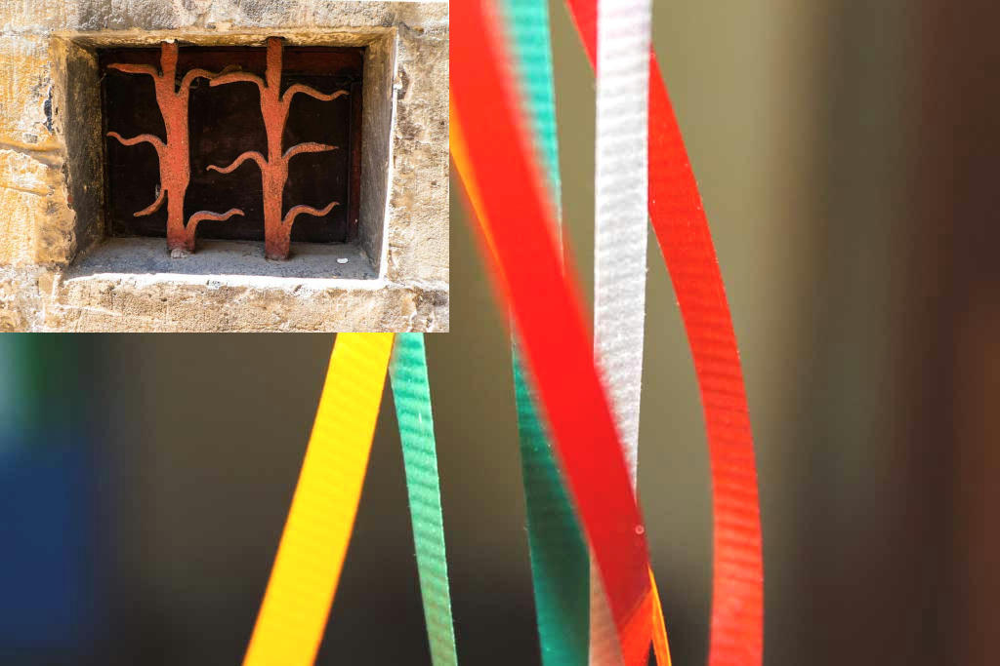
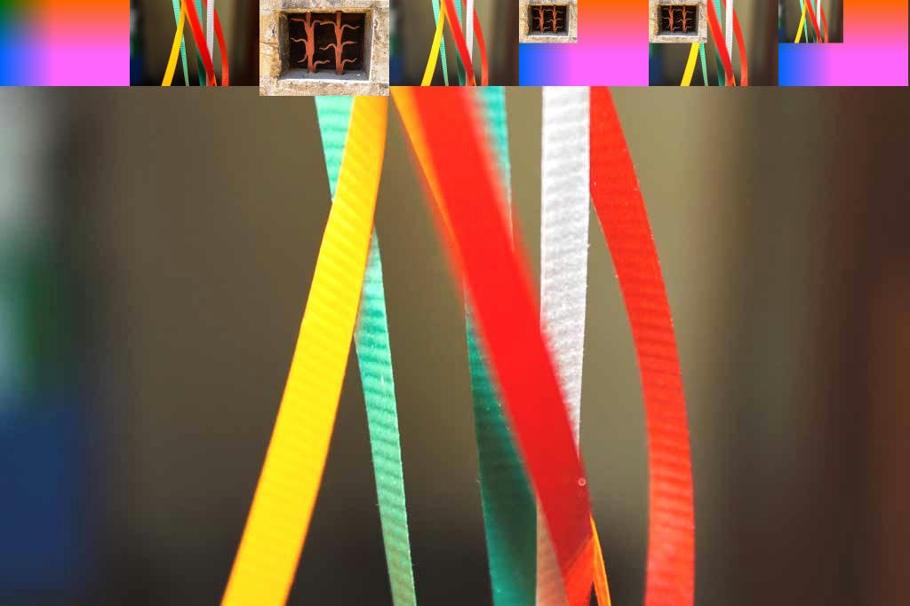
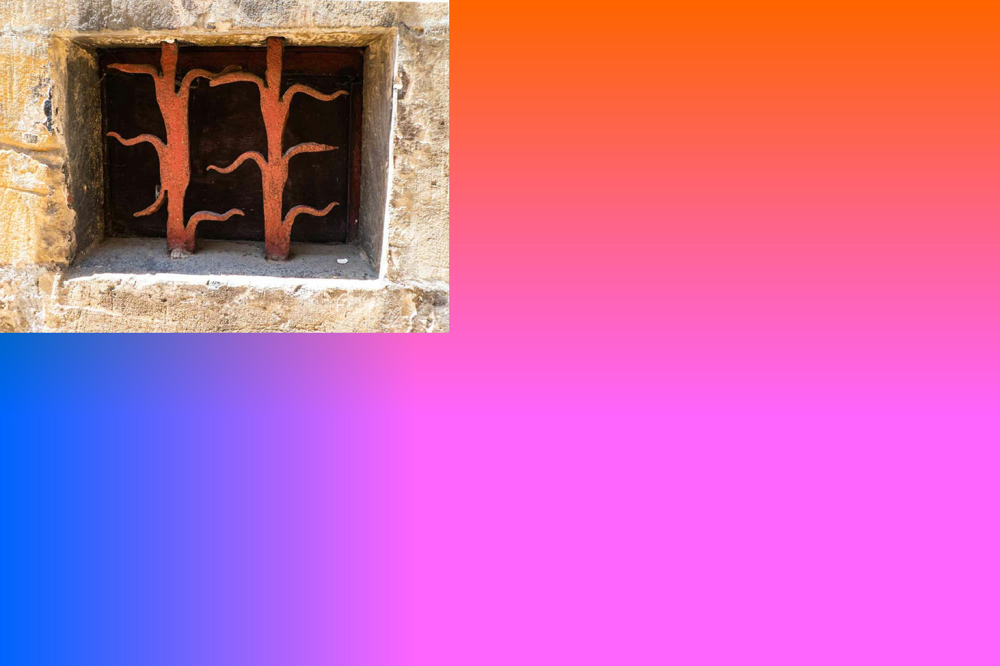
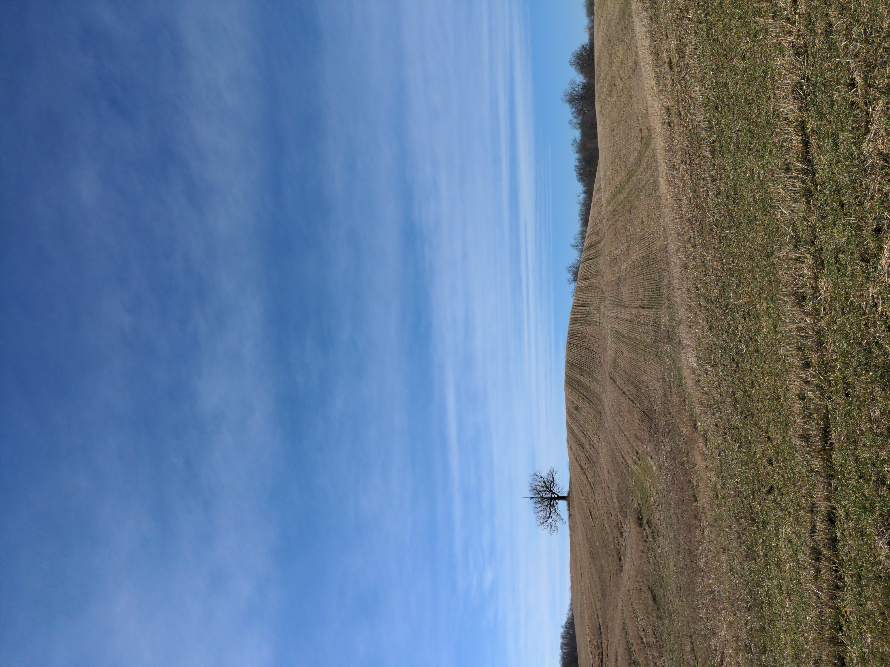

The following shorthand is proposed for naming C2PA test image files:

| Code  | Meaning                                    |
| ------------ | -----------------------------------------  |
| **C**        | claim                                      |
| **A**        | parent ingredient (acquisition)            |
| **I**        | ingredient                                 |
| **X**        | hash mismatch - off the golden path (OTGP) |
| **E-clm-**   | a referenced claim is missing |
| **E-dat-**   | hard binding hash mismatch (same as **X** or OTGP) |
| **E-sig-**   | signature did not validate |
| **E-uri-**   | an assertion has been tampered with (uri hash mismatch) |

## JPEG

adobe-20221004-ukraine_building.jpeg
nikon-20221019-building.jpeg

